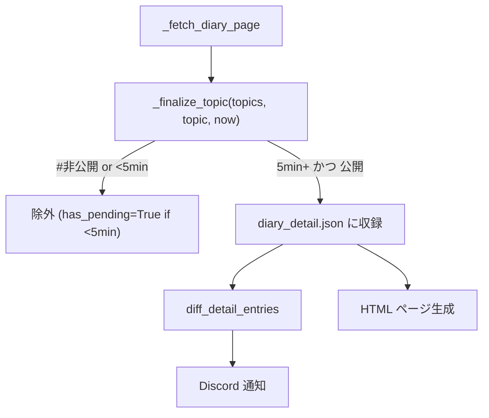

# 5分フィルタを取得時点に移動 Plan

## 変更対象

[diary_generator/contents.py](d:/Develop/diary_generator/diary_generator/contents.py) のみ

## 変更の方針

`_finalize_topic` に 5分フィルタを追加し、`#非公開` と同列に取得時点で除外する。  
ただし、5分未満トピックがあったページは次回実行で `last_edited_time` が変わっていなくても強制再取得する必要があるため、`has_pending_topics` フラグを detail エントリに付与して制御する。

## 変更後のデータフロー



Discord通知・ページ反映の入力が同じになる。

## 各変更の詳細

### 1. `_finalize_topic` に `now` と5分フィルタを追加、戻り値を `bool` に

```python
def _finalize_topic(
    topics: list[dict[str, Any]],
    topic: dict[str, Any],
    now: datetime,
) -> bool:  # True = 5分未満で保留
    if not topic.get("title"):
        return False
    if "非公開" in topic.get("tags", []):
        return False  # 確定除外（保留ではない）
    if _parse_iso_datetime(topic["last_edited_time"]) + timedelta(minutes=5) > now:
        return True   # 保留（次回再取得が必要）
    topic["plain_text"] = ...
    topics.append(topic)
    return False
```

### 2. `_fetch_diary_page(page_id, now)` の引数・戻り値を変更

- `now: datetime` を追加
- `_finalize_topic` 呼び出しに `now` を渡す
- 戻り値を `tuple[list[dict[str, Any]], bool]`（topics, has_pending）に変更

```python
def _fetch_diary_page(
    page_id: str, now: datetime
) -> tuple[list[dict[str, Any]], bool]:
    ...
    has_pending = False
    for block in all_blocks:
        if block_type == "heading_3":
            pending = _finalize_topic(topics, current_topic, now)
            has_pending = has_pending or pending
            current_topic = _new_topic(...)
            ...
        ...
    pending = _finalize_topic(topics, current_topic, now)
    has_pending = has_pending or pending
    return topics, has_pending
```

### 3. `_build_detail_entries` に `now` を追加し、フラグを保存・キャッシュ判定に利用

キャッシュ再利用の条件に `has_pending_topics` を加える:

```python
# 変更前
unchanged = (
    old_index_entry is not None
    and old_detail_entry is not None
    and old_index_entry.get("last_edited_time") == index_entry.get("last_edited_time")
)

# 変更後（has_pending_topics が True なら前回保留あり → 強制再取得）
unchanged = (
    old_index_entry is not None
    and old_detail_entry is not None
    and old_index_entry.get("last_edited_time") == index_entry.get("last_edited_time")
    and not old_detail_entry.get("has_pending_topics", False)
)
```

再取得時は `has_pending_topics` を保存（次回の判定に使う）:

```python
topics, has_pending = _fetch_diary_page(page_id, now)
detail_entries.append({
    "page_id": page_id,
    ...
    "topics": topics,
    "has_pending_topics": has_pending,
})
```

キャッシュ再利用時は `**old_detail_entry` のスプレッドで `has_pending_topics` が自然に引き継がれる（変更不要）。

### 4. `get()` で `now` を1回計算して渡す

```python
def get() -> list[DiaryEntry]:
    ...
    now = datetime.now(JST)
    ...
    detail_entries = _build_detail_entries(
        index_entries=index_entries,
        old_index_cache=old_index_cache,
        old_detail_cache=old_detail_cache,
        now=now,
    )
```

### 5. `_parse_json_to_diary_entries` から5分フィルタを削除

キャッシュ段階で保証されるため不要になる:

```python
# 変更前
now = datetime.now(JST)
topics = [
    Topic(...)
    for topic_data in entry_data["topics"]
    if now > _parse_iso_datetime(topic_data["last_edited_time"]) + timedelta(minutes=5)
]

# 変更後
topics = [Topic(...) for topic_data in entry_data["topics"]]
```

## 変更後の動作シナリオ

トピックBが3分前に編集されたページが存在する場合:

- 1回目の実行: Bは `_finalize_topic` でフィルタ → キャッシュに入らない、`has_pending_topics=True` → Discord通知なし → ページにも出ない
- 2回目の実行（5分超、Notion変更なし）: `has_pending_topics=True` により強制再取得 → BがフィルタをパスしてキャッシュとDiscordと両方に反映 → `add: date → B`
- 3回目以降: 通常のキャッシュ再利用

Discord通知とページ反映が常に一致する。

## 変更しないファイル

- `diarydiff.py` — 変更不要
- `filenames.py` — 変更不要
- `generator.py` / `html/` / `json/` — 変更不要
