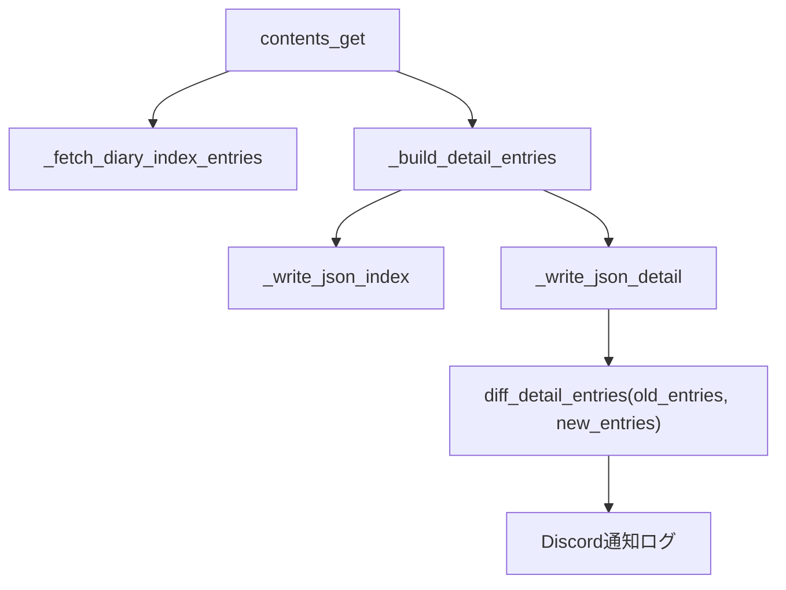

# 差分通知 detail 移行 Plan

## 変更対象ファイル

- [diary_generator/util/diarydiff.py](d:/Develop/diary_generator/diary_generator/util/diarydiff.py) — 主変更
- [diary_generator/contents.py](d:/Develop/diary_generator/diary_generator/contents.py) — 呼び出し側修正
- [diary_generator/config/filenames.py](d:/Develop/diary_generator/diary_generator/config/filenames.py) — 旧定数削除

## 変更方針

### 1. `diarydiff.py` の再設計

削除する関数:
- `copy_previous_json()` — 旧 JSON コピー、不要
- `diff_diary_json()` — ファイル読み込みラッパー、不要
- `diff_diary_data(old_data, new_data)` — 旧形式依存、削除

追加する関数:
- `diff_detail_entries(old_entries, new_entries)` — 新しい差分通知の中核

新関数の仕様:
- 入力: `diary_detail.json` の `entries` リスト同士（`list[dict[str, Any]]`）
- 主キー: `topic_id`（各トピックの `topics[].topic_id`）
- 比較単位: トピック単位
- 判定ロジック:
  - `topic_id` が旧にない → 新規 (`add`)
  - `topic_id` が旧にあって新にない → 削除 (`del`)
  - `topic_id` が両方にあって `last_edited_time` が変化 → 更新 (`changed`)
  - 変化なし → 通知しない
- 通知文フォーマット（平文）:
  - `add: YYYY-MM-DD → トピック名`
  - `del: YYYY-MM-DD → トピック名`
  - `changed: YYYY-MM-DD → トピック名`
- 初回（旧 entries が空）の場合: "Diaryを新しくダウンロードしました" を通知
- どちらかが空の場合: 警告通知のみ

モジュールレベル変数の削除:
- `old_file_path`, `new_file_path`（旧ファイルパスの参照ごと削除）

### 2. `contents.py` の修正

削除:
- `old_raw_data` の構築・渡し（`_compose_raw_data_from_caches` 呼び出し部分）
- `diary_data.json` への書き出し（`_write_json(config.FILE_NAMES.CACHE_DIARY_PATH, ...)` の行）
- `diarydiff.diff_diary_data(old_raw_data, new_raw_data)` の呼び出し

変更後の通知呼び出し:

```python
old_entries = old_detail_cache.get("entries", []) if old_detail_cache else []
diarydiff.diff_detail_entries(old_entries, detail_entries)
```

### 3. `filenames.py` の修正

削除する定数:
- `CACHE_DIARY_PATH`
- `CACHE_PREVIOUS_DIARY_PATH`

## 変更後の呼び出しフロー



## 注意点

- `old_detail_cache` が `None`（初回実行・キャッシュ破棄後）の場合は `old_entries = []` として渡すことで、「新規ダウンロード」通知が自然に発火する。
- `diary_data.json` / `diary_data_prev.json` は **コードから参照がなくなった時点で廃止**。既存ファイルが残っていてもエラーにはならないため、削除は手動運用で可。
