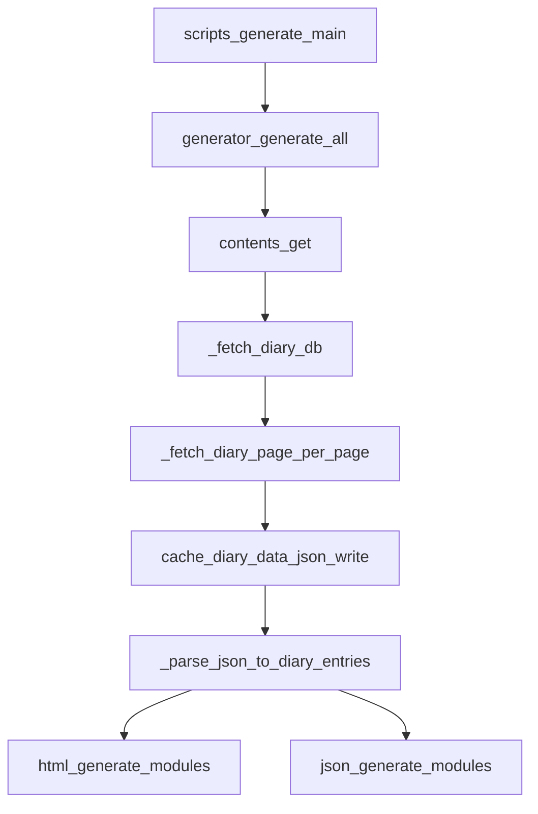

# 日記キャッシュ差分更新 Plan

## 前提と確定事項

- 仕様の正本は `docs/` を採用（`docs_by_ai/` は現行把握のみ）。
- 今回の方針は以下で確定:
  - `#非公開` は **内部キャッシュにも含めない（完全除外）**。
  - 最終更新から5分未満除外は **現行どおり維持**。
- 制約:
  - 公開URL互換を壊さない。
  - `#非公開` の完全除外を壊さない。
  - `source_status` / `is_public` など派生値はキャッシュに持たない。

## 1. 現行実装の主要ファイル（今回の変更に関係）

- 取得〜キャッシュの中核
  - [diary_generator/contents.py](d:/Develop/diary_generator/diary_generator/contents.py)
- 生成オーケストレーション
  - [diary_generator/generator.py](d:/Develop/diary_generator/diary_generator/generator.py)
  - [scripts/generate.py](d:/Develop/diary_generator/scripts/generate.py)
- キャッシュパス定義
  - [diary_generator/config/filenames.py](d:/Develop/diary_generator/diary_generator/config/filenames.py)
- 差分通知（既存 `diary_data.json` 前提）
  - [diary_generator/util/diarydiff.py](d:/Develop/diary_generator/diary_generator/util/diarydiff.py)
- 生成側（入力 `DiaryEntry` 依存）
  - [diary_generator/html/dates/detail.py](d:/Develop/diary_generator/diary_generator/html/dates/detail.py)
  - [diary_generator/html/topics/detail.py](d:/Develop/diary_generator/diary_generator/html/topics/detail.py)
  - [diary_generator/json/search.py](d:/Develop/diary_generator/diary_generator/json/search.py)
  - [diary_generator/models/diarycontents.py](d:/Develop/diary_generator/diary_generator/models/diarycontents.py)

## 2. 現行の「取得 -> キャッシュ -> HTML生成」フロー

- `contents.get()` が実質的な中核。
  - 現状は DB 一覧から対象ページを走査し、毎回 `_fetch_diary_page()` で詳細ブロック取得。
  - `cache/diary_data.json` を更新し、`_parse_json_to_diary_entries()` で `DiaryEntry` に変換。
- `generator.generate_all()` は `DiaryEntry` を受けて HTML/JSON 生成（ここは可能な限り維持するのが最小変更）。

## 3. 今回の変更で必要な処理単位

- キャッシュ構造導入
  - `diary_index.json`（一覧メタ）と `diary_detail.json`（詳細）を新設。
  - 両方に `schema_version` を持たせる。
- 一覧取得と差分判定
  - DB 一覧は毎回取得。
  - `page_id` + `last_edited_time` 比較で「新規/更新/非更新/削除」を判定。
- 詳細更新
  - 新規/更新ページのみ `_fetch_diary_page()` を実行。
  - 非更新は既存 `diary_detail.json` を再利用。
  - 削除ページは index/detail 双方から除去。
- 公開判定
  - `#非公開` は詳細キャッシュ作成時に除外（内部キャッシュにも残さない）。
  - 5分ルールは `DiaryEntry` 化の段階で現行維持。
- 既存生成接続
  - index+detail から現行 `DiaryEntry` を組み立て、既存 HTML/JSON 生成モジュールは極力無変更。

## 4. 変更対象ファイル案（最小変更優先）

- 主変更
  - [diary_generator/contents.py](d:/Develop/diary_generator/diary_generator/contents.py)
- 定数追加
  - [diary_generator/config/filenames.py](d:/Develop/diary_generator/diary_generator/config/filenames.py)
- 追随候補（必要時のみ）
  - [diary_generator/util/diarydiff.py](d:/Develop/diary_generator/diary_generator/util/diarydiff.py)
- 影響確認（変更最小化前提で原則据え置き）
  - [diary_generator/generator.py](d:/Develop/diary_generator/diary_generator/generator.py)
  - [diary_generator/html/](d:/Develop/diary_generator/diary_generator/html)
  - [diary_generator/json/](d:/Develop/diary_generator/diary_generator/json)

## 5. 段階的な実装ステップ（小さく分割）

### Step 1: キャッシュ構造だけ導入（読み書き可能化）

- 何を変更するか
  - `diary_index.json` / `diary_detail.json` の読み書き関数を追加。
  - 既存 `diary_data.json` フローは温存し、まずは新キャッシュの作成だけ可能にする。
- どのファイルを触るか
  - [diary_generator/config/filenames.py](d:/Develop/diary_generator/diary_generator/config/filenames.py)
  - [diary_generator/contents.py](d:/Develop/diary_generator/diary_generator/contents.py)
- この時点で動くこと
  - 新キャッシュファイルを生成できる（生成処理は従来どおり）。

### Step 2: 差分取得を導入（詳細の部分更新）

- 何を変更するか
  - DB 一覧結果から index を再構築。
  - 旧 index/detail を読み、新規・更新ページのみ詳細再取得。
  - 非更新は detail 再利用、削除は除去。
  - 失敗時は中途半端な index/detail を書かない（正常完了時のみ置換）。
- どのファイルを触るか
  - [diary_generator/contents.py](d:/Develop/diary_generator/diary_generator/contents.py)
- この時点で動くこと
  - Notion 詳細取得回数が差分分だけに減る。
  - index/detail が整合した状態で更新される。

### Step 3: 既存生成処理を新キャッシュへ接続

- 何を変更するか
  - `contents.get()` の入力を index+detail ベースに切り替え、`DiaryEntry` へ変換。
  - 生成モジュール側は `DiaryEntry` 契約を維持し、原則変更しない。
  - `#非公開` 完全除外・5分ルールが維持されることを確認。
- どのファイルを触るか
  - [diary_generator/contents.py](d:/Develop/diary_generator/diary_generator/contents.py)
  - （必要なら）[diary_generator/util/diarydiff.py](d:/Develop/diary_generator/diary_generator/util/diarydiff.py)
- この時点で動くこと
  - 既存 URL と生成結果を保ちながら、差分更新キャッシュでサイト生成できる。

### Step 4: 旧キャッシュ依存の整理（小さく）

- 何を変更するか
  - `diary_data.json` 前提のコードやログ表現を整理。
  - `diarydiff` の比較対象を新構造に合わせる。
- どのファイルを触るか
  - [diary_generator/util/diarydiff.py](d:/Develop/diary_generator/diary_generator/util/diarydiff.py)
  - [docs/features/diary_cache_update.md](d:/Develop/diary_generator/docs/features/diary_cache_update.md)（必要最小限の仕様追記のみ）
- この時点で動くこと
  - 新方式前提の運用に一本化できる。

## 6. 既存互換性で注意すべき点

- 公開URL互換
  - `topics` の canonical/legacy redirect 生成ロジックに影響を出さない（`DiaryEntry` の `Topic.title`/`hashtags` を維持）。
- `#非公開` 完全除外
  - 詳細キャッシュ段階で除外し、生成物（HTML/JSON検索）に絶対に混入させない。
- 5分ルール
  - 現在の除外タイミング（`_parse_json_to_diary_entries`）を維持。
- 生成の原子性
  - API失敗時はキャッシュを壊さない（temp 書き出し後に置換、または正常完了時のみ保存）。
- `page_id` 整合
  - index/detail のキー整合を常に保つ。

## 7. 不明点・確認すべき点

- `diarydiff` 通知を現行同等で維持するか（今回スコープに含めるか）。
  - →現行同等の仕様で維持してください
- 新キャッシュの `schema_version` 初期値（例: `1`）と、非互換時の運用（再生成のみで進めるか）。
  - →特に変換機構は設けず、基本的に全再生成で対応する想定です
- 既存 `cache/diary_data.json` の扱い（当面併存 or 早期廃止）。
  - →新しい枠組みが問題なければ早期廃止の想定です

## 8. 最小実装で進める推奨プラン

- 推奨は **Step 1 → Step 2 → Step 3** を最短で進め、`generator`/`html`/`json` 側は基本触らない。
- まず `contents.py` に差分更新ロジックを集約し、外部契約（`DiaryEntry` 入力）を保つ。
- `diarydiff` や補助改善は Step 4 に分離して、初回導入リスクを最小化する。

